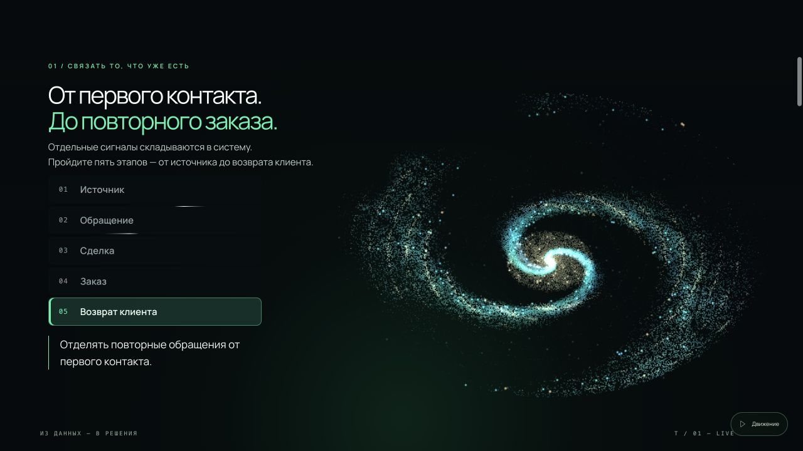

# TURBIUM

## Актуальный лендинг v3

**[Открыть демо на любом устройстве](https://oliverjone01-dev.github.io/turbium/landing/)** · **[Развернуть на VPS](docs/landing/DEPLOY.md)** · **[Плагин WordPress](packages/turbium-landing-wordpress.zip)**

Лендинг контроля маркетинга и продаж: интерактивная WebGL-сцена, пять разделов демонстрационного отчёта, локальные шрифты и фотографии. Учебные данные, без подключения реальных CRM.

```sh
git clone https://github.com/oliverjone01-dev/turbium.git
cd turbium
docker compose up -d
```

После установки Docker/Compose сайт доступен по `http://IP_СЕРВЕРА:8080`. Настройка домена и HTTPS описана в инструкции.

| Путь | Назначение |
|---|---|
| `www/landing/` | Публичная статическая версия v3 |
| `compose.yaml` | Просмотр по IP, порт 8080 |
| `compose.vps.yaml` | Домен, HTTPS и постоянное хранение сертификатов |
| `deploy/` | Конфигурация Caddy |
| `wordpress/` | Исходники shortcode-плагина |
| `packages/` | Готовый WordPress ZIP |
| `docs/landing/` | Инструкция, описание, промты, превью |
| `scripts/` | Проверка ресурсов и сборка WordPress ZIP |



## Предыдущие материалы проекта

Сохранены в исходных каталогах; ниже описание прежней структуры.


Независимое AI-агентство для малого и среднего бизнеса России. «Элемент вашего роста».

Этот репозиторий - дом проекта: сайт, платформа бренда, research-база, контент-фабрика.

## Структура

| Папка | Что внутри |
|---|---|
| `site/` | Сайт-платформа бренда: `index.html` (исходник), `build-locked.mjs` (сборка запароленной версии), `turbium-locked.html` (зашифрованная публикация) |
| `content/` | Launch plan, контент-планы каруселей и постов, мастер-промпты, Carousel Factory |
| `research/` | Исследования МСБ РФ с источниками, сводная верификация, JTBD/CJM-сегментация |
| `references/` | Эталонная карусель, визуальные референсы |
| `audit/` | Аудиты ФЕНИКСА |

## Сайт

Исходник: `site/index.html`. Публикуемая версия закрывается паролем (AES-256-GCM, ключ из пароля через PBKDF2):

```bash
cd site && node build-locked.mjs '<пароль>'
```

Результат `site/turbium-locked.html` - самодостаточный файл, расшифровка в браузере.

## Правила проекта

1. Каждая публичная цифра несёт источник и тег [ДАННЫЕ] или [ГИПОТЕЗА].
2. Вымышленные кейсы запрещены.
3. Запретный словарь: «уникальный», «эксклюзивный», «не упусти», «только сегодня».
4. Критические артефакты проходят adversarial-гейт перед публикацией.
